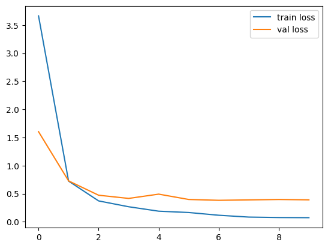
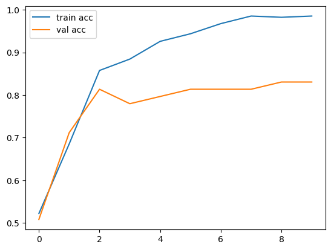

# Cat-Dog-Classification using VGG16

Computer Vision is an interdisciplinary field of study that focuses on enabling computers to interpret and understand visual information from the world around us. It involves the use of various techniques, including image processing, pattern recognition, and machine learning, to analyze and interpret digital images and videos. This project specifically focused on the use of deep learning, which is a subfield of machine learning that involves the use of neural networks to model complex relationships between input and output data. The VGG-16 model is a deep neural network architecture that has proven to be highly effective in image classification tasks, as demonstrated by its success in the ImageNet Large Scale Visual Recognition Challenge.

By applying this knowledge and utilizing the VGG-16 model, you were able to develop a high-performing image classification model for cats and dogs. This project showcases the practical application of computer vision and deep learning techniques in solving real-world problems, and highlights the importance of these techniques in the field of computer engineering.

The objective of this project is to develop a deep learning model using the VGG-16 architecture to classify images of cats and dogs with high accuracy.

## Task Performed: 
* Extracted features from the training images by pre-trained VGG16. Training set had 169 cat images & 168 dog images.
* Built the top layer for classification purpose.
* The validation loss & validation accuracy for the model was 0.39 & 84% respectively.
* Used Flask to build the web application.

| Loss                                                     | Accuracy                                                     |
|  |  |

## How to Run

1. conda create -n venv python=3.8 -y
2. conda activate venv
3. pip install -r requirements.txt
4. python application.py
5. open in browser: http://localhost:8080/

## Snapshot of the web app: 

